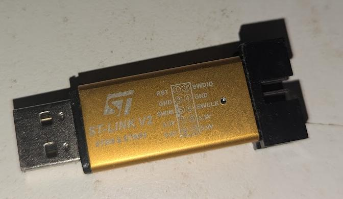

AM32 ESC Unlocker
-----------------

This is a tool for fast and easy unlocking of ESCs for the AM32
project.

The key benefits of using this tool over traditional debug tools are:

 - avoids the need to solder SWD cables
 - speed and simplicity
 - the same tool works with all AM32 MCU targets
 - bootloaders are included

Background
----------

A lot of ESCs come with flash locked preventing updates. This is most
common with BLHeli32 ESCs but may apply to others as well. In order to
move these ESCs to the AM32 firmware you need to unlock them and flash
a bootloader.

Note that the best option is to buy ESCs from vendors that ship with
AM32, in which case you don't need this tool at all. This tool is for
people who have 32 bit ESCs already that shipped with firmware other
than AM32 and want to migrate to AM32.

Usage
-----

You will need to download the linux or windows binaries for
"esc_updater" from the releases section of this repository.

On launch you will be presented with a screen like this:

You then need to select your MCU type. If you don't know the MCU type
then look at the MCU on your ESC under a magnifying glass.

You also need to select your signal pin. This is the pin on the MCU
that communicates with the flight controller (ie. the DShot signal
pin). This is usually PA2 or PB4.

Finding the SWD pads
--------------------

You need to find the SWD pads on your ESC. Some ESCs don't have
exposed SWD pads, in which case you may not be able to unlock at all.

Here is an example showing the 4 sets of SWD pads on a Foxeer 4-in-1
F421 ESC:

Note that you don't really need to identify which is SWDIO and which
is SWDCLK as the process of using this tool makes it very easy to swap
around when unlocking.

Connecting SWD
--------------

You will need a STLink-v2 SWD adapter. These are available cheaply
from places like ebay.

You will need to connect the ground pin of the STLink-v2 to ground on
your ESC.

Then you should get 2 male to female dupont leads. The two female ends
will connect to the SWDIO and SWDCLK pins on your STLink-v2.

The two male ends should be bent slightly so that when held together
they are separated by the distance between

Unlocking Process
-----------------

Choose the MCU and signal pin in the GUI, then press start. You will
see the "LED" in the display go red and you will hear a rapid low
beep. Attempts to flash your ESC will stream up the text box.

Now power on your ESC (preferably with no motor attached!) and then
press the tips of the two dupont pins against the SWD pads. Listen for
a change in sound as the tool finds the MCU. The tone will rise in
pitch and the "LED" in the display will go orange if it finds your
MCU. If it can't find the MCU then try the pins the other way around.

When the tool succeeds it plays a triple tone, says "Success!" and the
LED goes green. Your MCU is now flashed with an AM32 bootloader. You
can how use the normal AM32 config tools to load the right firmware
for your ESC and change settings.

Diagnostics
-----------

When it doesn't work you should find a file esc_unlocker.log in the
directory when you launched the unlocker. Share this file on the AM32
discord to see if someone can help.

CAUTION
-------

It is possible that this tool could permanently brick your ESC. It
isn't likely, but there are locking options in the MCUs that are not
reversible. If the wrong options are set then you will not be able to
recover your ESC, even with a soldered SWD connection. Use at own
risk.
